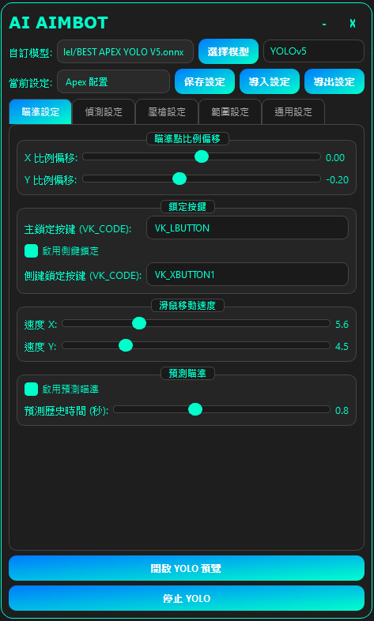
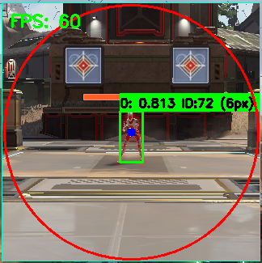

# AI AIMBOT YOLOv8 + YOLOv5
這是一個基於 YOLOv5/v8 的 AI 輔助瞄準工具。
> [!WARNING]
> **請自行承擔使用風險，不保證您不會被封鎖！**

> [!NOTE]
> **建議使用 GTX 1070 系列或更高等級的顯示卡，以獲得更穩定流暢的體驗。**


## 主要功能

*   **AI 目標偵測**: 使用 ONNX 格式的 YOLO 模型進行即時物件偵測。
*   **版本支援**: 支援 YOLOv5 和 YOLOv8 兩種架構。
*   **硬體加速**: 透過 DirectML 進行硬體加速，支援 AMD、NVIDIA 與 Intel 的 GPU。
*   **高度客製化**:
    *   可載入自訂的 `.onnx` 模型。
    *   支援匯入與匯出 JSON 格式的設定檔，方便分享與備份。
    *   提供多項參數調整，包含：
        *   瞄準範圍
        *   模型信賴度
        *   瞄準速度
        *   目標類別
*   **即時預覽**:
    *   獨立的預覽視窗，顯示模型偵測的即時畫面。
    *   可顯示偵測框、目標資訊與 FPS。
*   **後座力控制**:
    *   內建可調整的後座力補償系統。
*   **使用者友善**:
    *   圖形化介面，方便操作。
    *   支援最小化至系統匣，不干擾遊戲畫面。

## 程式介面預覽

<p align="center">
  
  
</p>

## 系統需求

*   **作業系統**: Windows 10 (版本 1903) 或更新版本
*   **GPU**: 支援 DirectX 12 的 GPU (AMD, NVIDIA, Intel)
*   **Python**: 3.10.8

## 安裝與執行
1.  **創建虛擬環境**:
    ```bash
    python -m venv venv
    ```
2.  **啟動虛擬環境**:
    ```bash
    venv\Scripts\activate
    ```

3.  **安裝相依套件**:
    ```bash
    pip install -r requirements.txt
    ```

4.  **執行程式**:
    ```bash
    python main.py
    ```

## 使用說明

1.  **啟動程式**: 執行 `main.py`。
2.  **選擇 YOLO 版本**: 在主介面的下拉選單中選擇要使用的 YOLO 版本 (YOLOv5 或 YOLOv8)。
3.  **載入模型**:
    *   程式會自動偵測 `Model/` 資料夾下的 `.onnx` 檔案。
    *   在模型下拉選單中選擇要使用的模型。
4.  **調整參數**: 根據需求調整介面上的各項參數，例如瞄準範圍、信賴度等。
5.  **儲存設定**: 點擊「保存當前設定」按鈕以儲存變更。設定會儲存於 `Data/` 資料夾下的 JSON 檔案。
6.  **啟動/停止 YOLO**: 點擊「啟動 YOLO」按鈕開始執行，再次點擊則停止。
7.  **預覽視窗**: 透過主介面上的「開啟/關閉 YOLO 預覽」按鈕，可以隨時顯示或隱藏即時預覽畫面。
