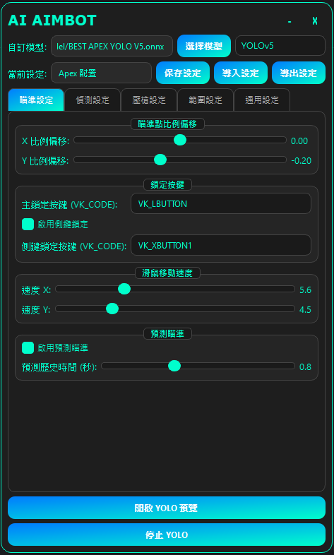
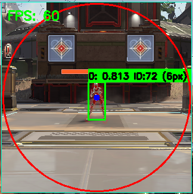

# AI AIMBOT MAX v1.0 (YOLOv5/YOLOv8/YOLOv11/YOLOv12)

這是一個基於 YOLO 的 AI 輔助瞄準與即時偵測工具，提供多推理後端、可調式瞄準參數與高效能畫面擷取。

> [!WARNING]
> **請自行承擔使用風險，不保證您不會被封鎖！**
>
> 
> **建議使用 GTX 1070 系列或更高等級顯示卡，以獲得更穩定流暢的體驗。**

## 專案特色

- **YOLO 多版本支援**：YOLOv5 / YOLOv8 / YOLOv11 / YOLOv12（ONNX）
- **多推理後端**：DirectML / CUDA / CPU / TensorRT
- **多擷取來源**：MSS / DXGI（bettercam）/ OBS UDP 串流
- **非同步推理管線**：latest-wins 策略降低延遲，提升 FPS
- **目標選擇與 NMS**：支援信賴度、IOU 閾值與目標類別篩選
- **瞄準控制**：偏移、速度、預測、PID、側鍵鎖定、自動縮放
- **後座力控制**：可調 X/Y 強度、延遲、觸發按鍵
- **視覺化疊加**：預覽視窗、瞄準框、偵測框、FPS/延遲 Overlay
- **設定管理**：JSON 匯入/匯出、多配置、系統匣最小化

## 程式介面預覽

<p align="center">
  
  
</p>

## 模型與推理後端

| 後端 | UI 顯示 | 模型格式 | 適用 GPU |
|---|---|---|---|
| DirectML | DirectML (AMD/Intel/NVIDIA) | `.onnx` | AMD / Intel / NVIDIA |
| CUDA | CUDA (NVIDIA) | `.onnx` | NVIDIA |
| CPU | CPU (通用) | `.onnx` | 全平台 |
| TensorRT | TensorRT (NVIDIA 高效能) | `.engine` | NVIDIA |

模型格式重點：

- DML / CUDA / CPU 使用 `.onnx`
- TensorRT 使用 `.engine`
- `.pt` 僅用於轉換，不支援直接推理

## 系統需求

- **作業系統**：Windows 10/11 64-bit
- **GPU**：DirectX 12 相容 GPU（DML），或 NVIDIA（CUDA/TRT）
- **Python**：3.10.x（建議 3.10.8）

## 擷取模式

| 模式 | 說明 | 特點 |
|---|---|---|
| MSS | `mss` | 穩定通用的螢幕截圖方式（預設） |
| DXGI | `dxgi` | 使用 bettercam 高效擷取，適合高 FPS |
| OBS UDP | `obs` | 使用 OpenCV + FFmpeg 低延遲 UDP 串流 |

## 快速開始

1. 安裝依賴

```bash
pip install -r requirements.txt
```

2. 啟動程式

```bash
python main.py
```

或直接執行 `run.bat`（使用預設 `venv` 時）。

3. 在 UI 中

- 選擇推理後端與 YOLO 版本
- 選擇模型檔案（`.onnx` 或 `.engine`）
- 調整參數後點擊「啟動 YOLO」

## 重要設定要點

- `model_size` 必須是 32 的倍數，且會決定擷取區域大小（以螢幕中心為基準）。
- 目標類別選單會在 YOLO 啟動後依模型 metadata 建立。
- 瞄準框顏色會依「目標是否在瞄準範圍內」自動切換。
- Aimbot 切換熱鍵建議使用單鍵；壓槍觸發鍵支援組合鍵。
- `auto_scale_aim_range` 會在按住右鍵時縮小瞄準範圍。
- 切換推理後端時需配合正確模型格式。
 - CUDA / TRT 請依 `本專案完整安裝教學.md` 安裝對應的 Runtime 與套件。

## TensorRT 轉換工具

專案提供一體化轉換 GUI：

- 腳本：`trt_converter_gui.py`
- 批次檔：`run_trt_converter_gui.bat`

功能：

- ONNX (`.onnx`) 轉 TensorRT Engine (`.engine`)
- PyTorch (`.pt`) 直接轉 TensorRT，或先 ONNX 再 TRT
- 支援 FP16/FP32、Workspace、Verbose 與即時日誌

## 完整安裝與進階設定

請參考 `本專案完整安裝教學.md`，包含：

- DML / CUDA / TensorRT 完整安裝流程
- 建議分 venv 安裝策略
- TensorRT 安裝與環境變數設定
- 常見問題排解

## 目錄結構

- `Data/`：設定檔與配置
- `Model/`：模型存放（建議放置 `.onnx` 或 `.engine`）
- `Module/`：核心模組
- `ui/`：UI 介面檔案
- `images/`：README 截圖
- `logs/`：日誌輸出
- `build_nuitka.bat`：DirectML 版本打包腳本
- `makcu_app.py`：Makcu 裝置工具（可選）

---

若遇到 TensorRT / CUDA 問題，請先確認依賴與環境變數是否完整。
